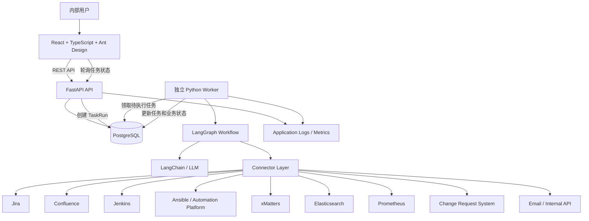
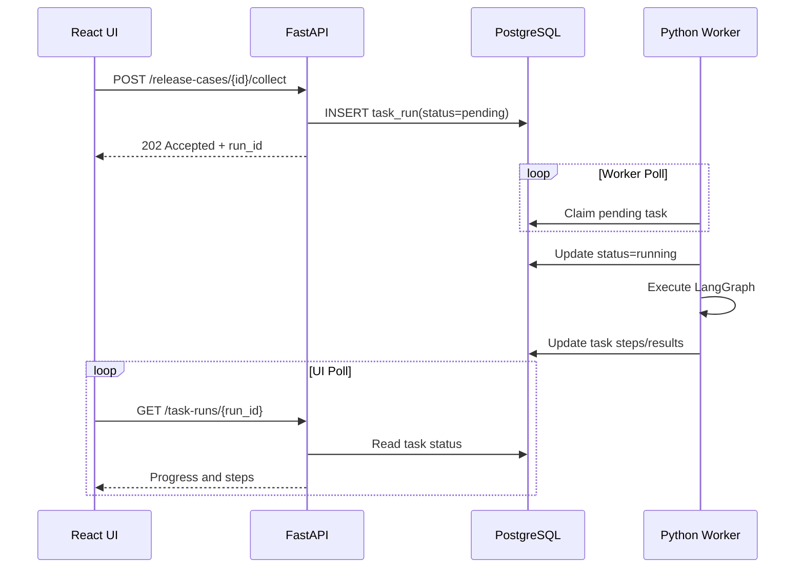
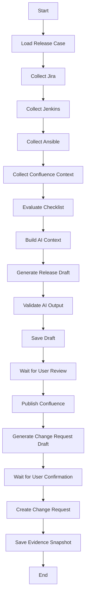
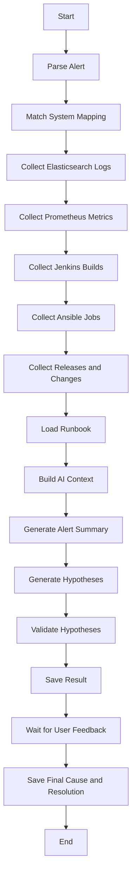
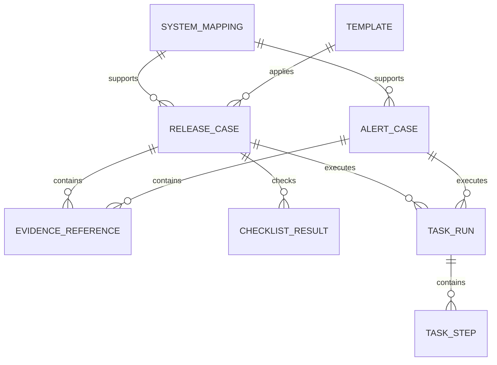
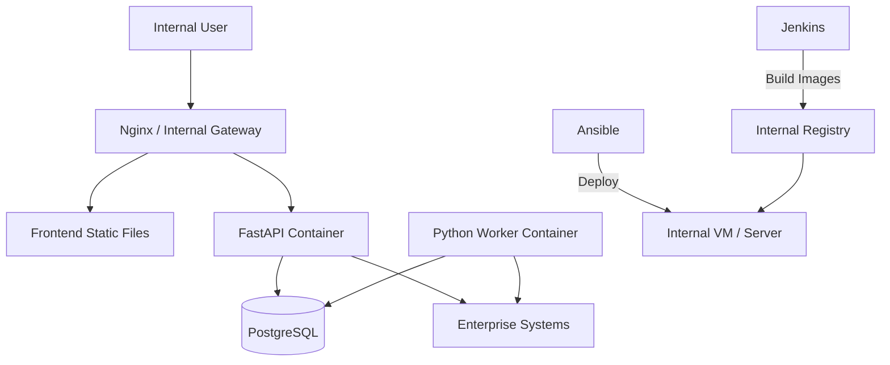

# 企业内部研发运维“最后一公里”效率助手
# 系统架构设计文档

> 文档版本：V0.1  
> 文档状态：架构初稿  
> 对应产品文档：PRD V0.2  
> 适用范围：20 人以内企业内部小团队  
> 最后更新：2026-07-24

---

## 1. 文档目的

本文档用于定义“企业内部研发运维最后一公里效率助手”的总体技术架构、模块边界、关键技术选型、数据流、后台任务机制、AI 编排方式、连接器设计、部署方式和非功能要求。

本架构遵循以下约束：

- 面向 20 人以内内部团队
- 优先保持轻量化
- 不建设通用商业平台能力
- 不采用微服务架构
- 不引入 Redis
- 不引入 Celery
- 前端暂不引入 TanStack Query
- 复用企业现有 Jenkins、Ansible、xMatters、Elasticsearch、Prometheus、Jira、Confluence 和 Change Request 系统
- 重点解决跨系统信息聚合、检查、生成和录入的“最后一公里”问题

---

# 2. 系统定位

本系统不是新的 CI/CD、自动化部署、日志、监控、告警或 ITSM 平台。

系统定位为：

> **连接企业已有研发运维系统，自动完成跨系统信息收集、规则检查、AI 辅助分析、文档生成和目标系统录入。**

系统主要包含两个核心业务工作流：

1. **Release Preparation & Change Request Assistant**
2. **Alert Triage Assistant**

后续可增加：

3. Jenkins Job Assistant
4. Requirement Analysis

---

# 3. 架构设计原则

## 3.1 轻量优先

首期架构只保留必要组件：

- React 前端
- FastAPI API
- 独立 Python Worker
- PostgreSQL
- 企业内部反向代理或 Nginx

不引入：

- Redis
- Celery
- RabbitMQ
- Kafka
- Kubernetes
- 微服务
- 微前端
- 通用工作流平台
- 独立向量数据库
- 图数据库

## 3.2 模块化单体

后端采用模块化单体：

- 一个后端代码仓库
- 一个 FastAPI 应用
- 一个 Worker 入口
- 一个 PostgreSQL 数据库
- API 与 Worker 复用 Domain、Connector、AI 和 Persistence 代码
- 业务模块在代码层保持边界
- 不进行服务间 RPC

## 3.3 原系统是 Source of Truth

以下系统仍然是权威数据源：

- Jira：工作项与版本
- Confluence：正式文档
- Jenkins：Build、测试和制品
- Ansible：自动化与部署执行
- xMatters：告警来源
- Elasticsearch：日志
- Prometheus：指标
- Change Request 系统：正式变更记录

本系统只保存：

- 外部系统对象 ID
- 外部链接
- 查询结果摘要
- 关键证据快照
- AI 输出
- 用户确认结果
- 任务运行状态
- 本系统操作日志

## 3.4 确定性逻辑与 AI 分离

确定性程序负责：

- 外部 API 调用
- 数据校验
- 字段映射
- Release Checklist
- 权限检查
- 任务状态
- 重试
- 外部写入
- 幂等控制

AI 负责：

- 内容总结
- 信息分类
- 风险解释
- Release 文档草稿
- Change Request 草稿
- 告警摘要
- 原因假设
- 下一步建议

## 3.5 人工确认

以下操作必须由用户确认：

- 发布 Confluence 文档
- 创建 Change Request
- 修改正式外部记录
- 触发后续高风险操作

Alert Triage 首期只读，不执行生产修复。

---

# 4. 技术栈

## 4.1 前端

| 类别 | 技术 |
|---|---|
| 框架 | React |
| 开发语言 | TypeScript |
| UI 组件库 | Ant Design |
| 构建工具 | Vite |
| 路由 | React Router |
| HTTP 请求 | 原生 `fetch` 或轻量封装 |
| 状态管理 | React Hooks、Context，按需使用局部状态 |
| 表单 | Ant Design Form |
| 测试 | Vitest、React Testing Library；端到端测试可用 Playwright |

首期暂不引入：

- TanStack Query
- Redux
- Zustand
- Next.js
- 微前端
- Module Federation

## 4.2 后端

| 类别 | 技术 |
|---|---|
| 开发语言 | Python |
| Web 框架 | FastAPI |
| 数据校验 | Pydantic |
| ORM | SQLAlchemy 2.x |
| 数据迁移 | Alembic |
| AI 基础组件 | LangChain |
| AI 工作流 | LangGraph |
| HTTP 客户端 | HTTPX |
| 测试 | Pytest |
| 代码质量 | Ruff、Mypy 或 Pyright |

## 4.3 数据与任务

| 类别 | 技术 |
|---|---|
| 业务数据库 | PostgreSQL |
| 后台任务队列 | PostgreSQL Task Table |
| 后台执行 | 独立 Python Worker |
| LangGraph 持久化 | PostgreSQL Checkpointer |
| 缓存 | 首期不设置独立缓存 |
| Redis | 不使用 |
| Celery | 不使用 |

## 4.4 构建与部署

| 类别 | 技术 |
|---|---|
| CI | 企业 Jenkins |
| 部署自动化 | 企业 Ansible |
| 容器 | Docker |
| 本地及首期编排 | Docker Compose |
| 反向代理 | Nginx 或企业内部网关 |
| Secret | 企业 Secret Manager、Ansible Vault 或环境变量注入 |
| 日志输出 | JSON 结构化日志 |
| 指标 | 暴露 Prometheus Metrics 或接入现有监控 |

---

# 5. 总体架构



---

# 6. 运行时组件

## 6.1 Frontend

职责：

- Release Case 页面
- Alert Case 页面
- 配置页面
- Task Run 进度页面
- 表单编辑与校验
- Checklist 展示
- AI 输出预览与修改
- 外部系统 Deep Link
- 用户确认操作

前端不直接访问企业内部平台。

错误示例：

```text
Browser -> Jenkins
Browser -> Elasticsearch
Browser -> Change Request API
```

正确方式：

```text
Browser -> FastAPI -> Connector -> Enterprise System
```

原因：

- 避免凭证暴露
- 统一认证和审计
- 统一错误处理
- 统一字段转换
- 便于后续更换系统

## 6.2 FastAPI API

职责：

- 提供 REST API
- 接收用户请求
- Pydantic 参数校验
- 管理 ReleaseCase 和 AlertCase
- 接收 xMatters Webhook
- 创建后台 TaskRun
- 查询任务状态
- 提交用户确认
- 执行短耗时外部写操作，或创建外部写入任务
- 返回 OpenAPI 文档

FastAPI 不直接执行长耗时完整流程。

## 6.3 Python Worker

职责：

- 从 PostgreSQL 领取待执行任务
- 执行 Release LangGraph
- 执行 Alert LangGraph
- 调用 Connector
- 运行 Release Checklist
- 构建 AI 上下文
- 调用 LangChain / LLM
- 校验 AI 输出
- 更新 TaskRun 和 TaskStep
- 处理失败、重试和超时恢复

首期部署一个 Worker 即可。

后续任务量增加时，可以启动多个 Worker，并通过 PostgreSQL 行锁避免重复领取。

## 6.4 PostgreSQL

同时承担：

- 业务数据存储
- 任务队列表
- 任务步骤状态
- Evidence Reference
- 操作日志
- LangGraph Checkpoint
- AI 结果与 Prompt 版本记录

PostgreSQL 是首期唯一必须维护的有状态基础组件。

## 6.5 Connector Layer

Connector 负责连接企业已有系统。

首期连接器：

- JiraConnector
- ConfluenceConnector
- JenkinsConnector
- AnsibleConnector
- XMattersConnector
- ElasticsearchConnector
- PrometheusConnector
- ChangeRequestConnector
- EmailConnector

Connector 不包含 Release 或 Alert 业务逻辑。

---

# 7. 前端架构

## 7.1 页面结构

```text
/
├── releases
│   ├── list
│   ├── create
│   └── :releaseCaseId
├── alerts
│   ├── list
│   └── :alertCaseId
├── configuration
│   ├── system-mappings
│   ├── connectors
│   ├── release-templates
│   ├── checklist-rules
│   └── change-field-mappings
└── operations
    ├── task-runs
    └── system-logs
```

## 7.2 前端目录建议

```text
frontend/
├── src/
│   ├── main.tsx
│   ├── app/
│   │   ├── router.tsx
│   │   ├── AppLayout.tsx
│   │   └── theme.ts
│   ├── pages/
│   │   ├── releases/
│   │   ├── alerts/
│   │   ├── configuration/
│   │   └── operations/
│   ├── features/
│   │   ├── release-case/
│   │   ├── release-checklist/
│   │   ├── change-request/
│   │   ├── alert-triage/
│   │   ├── evidence/
│   │   └── task-run/
│   ├── components/
│   │   ├── StatusTag.tsx
│   │   ├── EvidenceLink.tsx
│   │   ├── ConnectorResult.tsx
│   │   ├── TaskProgress.tsx
│   │   └── ErrorState.tsx
│   ├── api/
│   │   ├── client.ts
│   │   ├── releases.ts
│   │   ├── alerts.ts
│   │   ├── configuration.ts
│   │   └── taskRuns.ts
│   ├── hooks/
│   ├── types/
│   └── utils/
```

## 7.3 数据请求方式

首期使用轻量封装：

```typescript
export async function apiRequest<T>(
  path: string,
  options?: RequestInit,
): Promise<T> {
  const response = await fetch(`/api${path}`, {
    headers: {
      "Content-Type": "application/json",
      ...options?.headers,
    },
    ...options,
  });

  if (!response.ok) {
    throw new Error(`Request failed: ${response.status}`);
  }

  return response.json() as Promise<T>;
}
```

页面使用：

- `useState`
- `useEffect`
- 自定义 Hook
- Ant Design `message`、`notification` 和 `Form`

首期应避免构建复杂的通用前端请求框架。

## 7.4 Task Run 轮询

前端通过简单 Hook 轮询任务：

```typescript
function useTaskRun(runId?: string) {
  const [taskRun, setTaskRun] = useState<TaskRun | null>(null);

  useEffect(() => {
    if (!runId) return;

    let stopped = false;

    async function load() {
      const result = await getTaskRun(runId);
      if (!stopped) {
        setTaskRun(result);
      }

      if (
        !stopped &&
        result.status !== "completed" &&
        result.status !== "failed"
      ) {
        window.setTimeout(load, 2000);
      }
    }

    load();

    return () => {
      stopped = true;
    };
  }, [runId]);

  return taskRun;
}
```

首期轮询间隔建议为 2 至 5 秒。

## 7.5 Ant Design 使用建议

### Release 页面

- `Form`：Release 基本信息
- `Steps`：收集、检查、生成、确认、提交
- `Table`：Jira Issue、Build 和测试结果
- `Descriptions`：Release 概览
- `Tag`：状态和严重程度
- `Alert`：Blocking、Warning 和缺失信息
- `Collapse`：外部数据明细
- `Drawer`：Evidence 详情
- `Modal`：Change Request 提交确认
- `Upload`：手动测试证据
- `Result`：提交结果

### Alert 页面

- `Descriptions`：告警概览
- `Tabs`：日志、指标、最近变更、AI 分析
- `Timeline`：告警和变更时间线
- `Table`：日志分类和最近执行
- `Tag`：Severity 和 Confidence
- `Alert`：数据源失败与信息缺口
- `Collapse`：关键日志摘要
- `Typography`：原因假设和下一步建议

---

# 8. 后端模块设计

## 8.1 目录建议

```text
backend/
├── app/
│   ├── main.py
│   ├── api/
│   │   ├── release_cases.py
│   │   ├── alert_cases.py
│   │   ├── task_runs.py
│   │   ├── configuration.py
│   │   └── webhooks.py
│   ├── application/
│   │   ├── release_service.py
│   │   ├── alert_service.py
│   │   ├── task_service.py
│   │   └── confirmation_service.py
│   ├── domain/
│   │   ├── release/
│   │   ├── alert/
│   │   ├── task/
│   │   ├── evidence/
│   │   └── rules/
│   ├── graphs/
│   │   ├── release/
│   │   │   ├── graph.py
│   │   │   ├── state.py
│   │   │   └── nodes.py
│   │   └── alert/
│   │       ├── graph.py
│   │       ├── state.py
│   │       └── nodes.py
│   ├── ai/
│   │   ├── gateway.py
│   │   ├── models.py
│   │   ├── schemas.py
│   │   ├── context_builders.py
│   │   └── prompts/
│   ├── connectors/
│   │   ├── base.py
│   │   ├── jira.py
│   │   ├── confluence.py
│   │   ├── jenkins.py
│   │   ├── ansible.py
│   │   ├── xmatters.py
│   │   ├── elasticsearch.py
│   │   ├── prometheus.py
│   │   ├── change_request.py
│   │   └── email.py
│   ├── rules/
│   │   ├── evaluator.py
│   │   └── release_rules.py
│   ├── persistence/
│   │   ├── database.py
│   │   ├── models/
│   │   ├── repositories/
│   │   └── langgraph_checkpointer.py
│   ├── worker/
│   │   ├── main.py
│   │   ├── task_claiming.py
│   │   ├── task_execution.py
│   │   └── recovery.py
│   ├── schemas/
│   ├── settings/
│   └── observability/
├── alembic/
├── tests/
└── pyproject.toml
```

## 8.2 分层职责

### API Layer

- HTTP 协议
- Pydantic 请求校验
- 鉴权上下文
- 调用 Application Service
- 返回统一 Response

### Application Layer

- 用例编排
- 创建业务对象
- 创建 TaskRun
- 用户确认
- 状态流转
- 外部写入前置校验

### Domain Layer

- Release 状态
- Alert 状态
- Checklist 结果
- Evidence 规则
- 业务约束

### Connector Layer

- 第三方认证
- API 请求
- 超时与重试
- 外部响应转换
- Deep Link
- 错误标准化

### AI Layer

- 模型调用
- Prompt
- Context Builder
- Structured Output
- AI 结果校验

### Worker Layer

- 任务领取
- LangGraph 执行
- 失败恢复
- 重试调度
- TaskRun 更新

### Persistence Layer

- ORM
- Repository
- Transaction
- LangGraph Checkpoint
- 数据迁移

---

# 9. Pydantic 模型设计

Pydantic 模型不与 SQLAlchemy ORM 模型完全共用。

## 9.1 API Schema

```python
class ReleaseCaseCreate(BaseModel):
    system_mapping_id: UUID
    release_name: str
    version: str
    environment: str
    planned_time: datetime
    jira_version: str | None = None
```

## 9.2 Connector DTO

```python
class BuildEvidence(BaseModel):
    external_id: str
    job_name: str
    build_number: int
    status: str
    started_at: datetime | None = None
    completed_at: datetime | None = None
    source_url: str
```

## 9.3 AI Structured Output

```python
class AlertHypothesis(BaseModel):
    title: str
    confidence: float = Field(ge=0, le=1)
    supporting_evidence_ids: list[UUID]
    contradicting_evidence_ids: list[UUID] = []
    verification_steps: list[str]
```

## 9.4 LangGraph State

```python
class AlertGraphState(TypedDict):
    alert_case_id: str
    mapping_id: str | None
    evidence_ids: list[str]
    log_summary: dict | None
    metric_summary: dict | None
    hypotheses: list[dict]
    missing_information: list[str]
```

## 9.5 Settings

Pydantic Settings 管理：

- PostgreSQL DSN
- LLM Provider
- Connector Timeout
- Worker Poll Interval
- Worker ID
- Log Level
- Secret References
- 环境开关

---

# 10. Connector 架构

## 10.1 统一原则

每个 Connector 必须处理：

- 认证
- 连接超时
- 读取超时
- 重试
- 返回值校验
- 错误转换
- 敏感信息脱敏
- Deep Link 构建
- 请求关联 ID
- 返回数据量限制

## 10.2 统一错误类型

```python
class ConnectorError(Exception):
    code: str
    retryable: bool
    safe_message: str
```

常见错误：

- `AUTHENTICATION_FAILED`
- `PERMISSION_DENIED`
- `NOT_FOUND`
- `TIMEOUT`
- `RATE_LIMITED`
- `INVALID_RESPONSE`
- `CONNECTION_FAILED`
- `CONFIGURATION_ERROR`

## 10.3 Connector 接口示例

```python
from typing import Protocol

class JenkinsConnector(Protocol):
    async def get_build(
        self,
        job_name: str,
        build_number: int,
    ) -> BuildEvidence:
        ...

    async def get_latest_build(
        self,
        job_name: str,
        parameters: dict[str, str] | None = None,
    ) -> BuildEvidence | None:
        ...

    async def get_test_report(
        self,
        job_name: str,
        build_number: int,
    ) -> TestEvidence | None:
        ...
```

## 10.4 外部数据转换

第三方原始响应不能直接传递到前端。

统一转换为：

- `IssueEvidence`
- `BuildEvidence`
- `TestEvidence`
- `DeploymentEvidence`
- `LogEvidence`
- `MetricEvidence`
- `DocumentEvidence`
- `ChangeRequestEvidence`

---

# 11. 后台任务设计

## 11.1 为什么需要独立 Worker

Release 和 Alert 流程包含多个外部调用和 AI 调用，可能持续数秒至数分钟。

API 请求不应等待完整流程执行结束。

标准流程：



## 11.2 TaskRun 表

建议字段：

```text
id
task_type
case_type
case_id
status
priority
payload
current_step
progress
attempt_count
max_attempts
available_at
locked_at
locked_by
started_at
completed_at
error_code
error_message
created_at
updated_at
```

## 11.3 TaskStep 表

```text
id
task_run_id
step_name
status
sequence
started_at
completed_at
duration_ms
error_code
error_message
result_summary
```

## 11.4 任务领取

Worker 使用 PostgreSQL 行锁领取任务：

```sql
SELECT id
FROM task_run
WHERE status = 'pending'
  AND available_at <= NOW()
ORDER BY priority ASC, created_at ASC
FOR UPDATE SKIP LOCKED
LIMIT 1;
```

领取后立即更新：

```text
status = running
locked_at = now()
locked_by = worker_id
started_at = now()
```

## 11.5 Worker 循环

```python
def run_worker() -> None:
    while True:
        task = claim_next_task()

        if task is None:
            time.sleep(settings.worker_poll_interval_seconds)
            continue

        execute_task_safely(task)
```

## 11.6 失败与重试

可重试错误：

- 外部服务临时不可用
- Timeout
- HTTP 429
- HTTP 502 / 503 / 504
- 模型临时失败

不可重试错误：

- 配置缺失
- 认证失败
- 权限不足
- 参数非法
- 目标对象不存在

重试策略首期保持简单：

```text
第 1 次失败：1 分钟后
第 2 次失败：5 分钟后
第 3 次失败：标记失败
```

## 11.7 崩溃恢复

定期查找：

```text
status = running
locked_at 超过设定时间
completed_at 为空
```

将其恢复为：

- `pending`，允许重试
- 或 `failed`，需要人工处理

具体取决于步骤是否具备幂等性。

## 11.8 幂等性

必须防止：

- 同一 Release 重复收集导致数据冲突
- 重复创建 Confluence 页面
- 重复创建 Change Request
- 重复处理同一个 xMatters 告警

建议使用：

- External ID 唯一约束
- Idempotency Key
- Change Request Reference
- Confluence Page Reference
- Task Type + Case ID + Active Status 唯一约束

---

# 12. LangChain 与 LangGraph

## 12.1 LangChain 职责

LangChain 用于：

- LLM Provider 抽象
- Prompt Template
- Structured Output
- Tool Schema
- 文档内容处理
- 模型重试
- 模型参数配置

## 12.2 LangGraph 职责

LangGraph 用于：

- 流程节点编排
- 条件分支
- 状态传递
- Checkpoint
- Human-in-the-loop
- 暂停与恢复
- 失败后的流程恢复

## 12.3 不采用自由 Agent

首期不采用由 LLM 自主决定工具调用的 Agent Loop。

不允许 AI 自主：

- 生成任意 Elasticsearch 查询并执行
- 生成任意 PromQL 并执行
- 触发 Jenkins
- 执行 Ansible
- 创建 Change Request
- 修改生产系统

首期模式：

```text
程序决定工作流
    ↓
程序调用预配置 Connector
    ↓
生成统一 Evidence
    ↓
Context Builder 选择必要数据
    ↓
LLM 生成结构化输出
    ↓
Pydantic 校验
    ↓
用户确认
```

---

# 13. Release LangGraph



## 13.1 数据收集节点

每个节点：

- 读取 SystemMapping
- 调用 Connector
- 转换为 Evidence
- 保存 EvidenceReference
- 更新 TaskStep
- 数据源失败时记录缺失信息

## 13.2 Checklist 节点

Checklist 不调用 LLM。

输出：

- Passed
- Warning
- Blocking
- Not Available
- Overridden

## 13.3 用户确认节点

用户确认通过 API 完成。

LangGraph 使用持久化状态，在确认后恢复。

---

# 14. Alert LangGraph



## 14.1 AI 输出约束

最多三个原因假设。

每个假设包含：

- 标题
- 置信度
- 支持 Evidence ID
- 反向证据或不确定信息
- 验证步骤

AI 不得将假设直接标记为已确认根因。

---

# 15. API 设计

## 15.1 Release API

```text
GET    /api/release-cases
POST   /api/release-cases
GET    /api/release-cases/{id}
PATCH  /api/release-cases/{id}

POST   /api/release-cases/{id}/collect
POST   /api/release-cases/{id}/generate-draft
POST   /api/release-cases/{id}/confirm-content
POST   /api/release-cases/{id}/publish-confluence
POST   /api/release-cases/{id}/generate-change-draft
POST   /api/release-cases/{id}/create-change-request

GET    /api/release-cases/{id}/evidence
GET    /api/release-cases/{id}/checklist
```

## 15.2 Alert API

```text
GET    /api/alert-cases
GET    /api/alert-cases/{id}
PATCH  /api/alert-cases/{id}

POST   /api/alert-cases/{id}/collect
POST   /api/alert-cases/{id}/analyze
POST   /api/alert-cases/{id}/feedback

POST   /api/webhooks/xmatters
```

## 15.3 Task API

```text
GET    /api/task-runs
GET    /api/task-runs/{id}
POST   /api/task-runs/{id}/retry
POST   /api/task-runs/{id}/cancel
```

## 15.4 Configuration API

```text
GET    /api/system-mappings
POST   /api/system-mappings
PATCH  /api/system-mappings/{id}

GET    /api/connectors
POST   /api/connectors/{id}/test

GET    /api/templates
POST   /api/templates
PATCH  /api/templates/{id}

GET    /api/checklist-rules
POST   /api/checklist-rules
PATCH  /api/checklist-rules/{id}
```

---

# 16. 数据模型

## 16.1 核心实体



## 16.2 SystemMapping

```text
id
system_name
service_name
environment
owner
jira_project
jenkins_job_config
ansible_config
elasticsearch_query_config
prometheus_query_config
runbook_url
confluence_config
change_request_config
enabled
created_at
updated_at
```

## 16.3 ReleaseCase

```text
id
system_mapping_id
release_name
version
release_type
environment
planned_time
owner
jira_version
status
ai_draft
confirmed_content
confluence_reference
change_request_reference
created_by
created_at
updated_at
```

## 16.4 AlertCase

```text
id
external_alert_id
source
raw_reference
system_mapping_id
severity
environment
started_at
status
log_summary
metric_summary
recent_changes
ai_summary
hypotheses
missing_information
final_cause
resolution_action
feedback
created_at
updated_at
```

## 16.5 EvidenceReference

```text
id
case_type
case_id
source_system
evidence_type
external_id
source_url
retrieved_at
summary
snapshot_data
content_hash
created_at
```

## 16.6 ChecklistResult

```text
id
release_case_id
rule_key
rule_name
severity
blocking
status
message
evidence_reference_id
overridden
override_reason
updated_at
```

## 16.7 ConnectorConfig

```text
id
connector_type
name
endpoint
auth_type
secret_reference
configuration
enabled
last_tested_at
last_test_status
created_at
updated_at
```

---

# 17. LangGraph 持久化

LangGraph Checkpoint 使用 PostgreSQL。

建议与业务表逻辑隔离：

```text
public schema:
  release_case
  alert_case
  task_run
  task_step
  evidence_reference
  checklist_result

langgraph schema:
  LangGraph checkpoint tables
```

每个流程使用稳定的 Thread ID：

```text
release:{release_case_id}
alert:{alert_case_id}
```

TaskRun 与 LangGraph Thread ID 建立关联。

---

# 18. 安全设计

## 18.1 认证

优先使用企业 SSO。

若首期无法接入 SSO，可使用企业内部反向代理认证或轻量登录机制，但不建议自建复杂身份系统。

## 18.2 Secret 管理

Secret 不存储在普通配置 JSON 中。

可选方式：

1. 企业 Secret Manager
2. Ansible Vault 注入
3. Docker Secret
4. 受控环境变量

数据库只保存 `secret_reference`。

## 18.3 最小权限

集成账号只获得所需能力：

- Jira：读取指定 Project
- Confluence：读取模板、写入指定 Space
- Jenkins：读取指定 Job；后续按需触发
- Elasticsearch：只读指定 Index
- Prometheus：只读查询
- Change System：创建指定类型 Change
- Ansible：首期只读 Job 信息

## 18.4 日志脱敏

禁止写入日志：

- Token
- Password
- Cookie
- Authorization Header
- 完整 Secret
- 敏感用户信息
- 未经过滤的生产日志正文

## 18.5 AI 数据控制

发送给模型前：

- 限制日志数量和长度
- 过滤 Secret
- 过滤用户隐私
- 只发送必要字段
- 记录使用的 Evidence ID
- 保存模型和 Prompt 版本

---

# 19. 本系统日志与可观测性

## 19.1 日志类型

### Application Log

- API 请求
- 页面接口异常
- 数据库异常
- 系统错误

### Connector Log

- Connector
- Operation
- 外部状态码
- Duration
- Retry
- Error Code

### Task Log

- TaskRun
- TaskStep
- 当前步骤
- 状态变化
- 失败和恢复

### Operation Log

- 用户确认
- Confluence 写入
- Change Request 创建
- 用户修改版本
- Alert 最终原因填写

## 19.2 统一字段

```text
timestamp
level
request_id
run_id
release_case_id
alert_case_id
user_id
connector
operation
status
duration_ms
error_code
message
```

## 19.3 Metrics

首期建议暴露：

- HTTP 请求数量和错误率
- API 延迟
- Worker 任务数量
- Pending Task 数量
- Task 成功率
- Task 执行时间
- Connector 成功率
- Connector 延迟
- AI 调用成功率
- AI 延迟
- Change Request 创建成功率

## 19.4 健康检查

```text
GET /health/live
GET /health/ready
```

Readiness 检查：

- PostgreSQL
- 必要配置
- Worker 心跳状态

外部 Connector 不应全部加入 API Readiness，否则一个外部系统故障会导致本应用被判定不可用。

---

# 20. 部署架构

## 20.1 容器组成

```text
frontend
api
worker
postgres
reverse-proxy
```

如果使用企业托管 PostgreSQL，则可移除本地 `postgres` 容器。

## 20.2 部署拓扑



## 20.3 Docker Compose 示例结构

```yaml
services:
  frontend:
    image: internal-registry/last-mile-frontend:${VERSION}

  api:
    image: internal-registry/last-mile-backend:${VERSION}
    command: uvicorn app.main:app --host 0.0.0.0 --port 8000

  worker:
    image: internal-registry/last-mile-backend:${VERSION}
    command: python -m app.worker.main

  postgres:
    image: postgres:17

  reverse-proxy:
    image: nginx:stable
```

## 20.4 CI/CD

Jenkins Pipeline 负责：

- 前端依赖安装
- TypeScript 检查
- 前端测试
- 前端 Build
- Python 依赖安装
- Ruff
- 类型检查
- Pytest
- Docker Image Build
- 镜像发布
- 生成版本信息

Ansible 负责：

- 拉取镜像
- 注入配置
- 执行 Alembic Migration
- 启动或更新容器
- 健康检查
- 必要时回滚应用版本

---

# 21. 测试策略

## 21.1 后端

### Unit Test

- Domain 规则
- Checklist
- Pydantic Schema
- Connector Response Mapping
- AI Output Validator
- Task Retry Logic

### Integration Test

- PostgreSQL Repository
- Task Claiming
- LangGraph Checkpoint
- Connector Mock Server
- API + Database

### Contract Test

为企业系统维护响应样例：

- Jira
- Jenkins
- Ansible
- Elasticsearch
- Prometheus
- xMatters
- Change Request

避免外部返回结构变化导致系统静默错误。

## 21.2 前端

- 表单校验
- Checklist 展示
- Task Progress
- 错误状态
- 用户确认 Modal
- Release 和 Alert 页面主流程

## 21.3 E2E

使用 Playwright 覆盖：

- 创建 Release Case
- 执行数据收集
- 查看 Checklist
- 确认并发布文档
- 创建 Change Request
- 接收告警
- 查看告警聚合结果
- 提交最终原因反馈

---

# 22. 错误处理

## 22.1 部分失败原则

多个数据源查询中，一个失败不应导致整体结果不可用。

示例：

```text
Jira: Success
Jenkins: Success
Ansible: Failed
Elasticsearch: Not Applicable
AI Draft: Generated with missing Ansible evidence
```

## 22.2 前端展示

错误必须包含：

- 哪个系统失败
- 哪个操作失败
- 是否可重试
- 是否影响最终结果
- 原始系统链接
- 安全的错误说明

## 22.3 AI 降级

AI 不可用时：

- Release 仍可查看收集数据和 Checklist
- Alert 仍可查看日志、指标和最近变更
- 用户可以手动完成文档或分析
- 不阻止外部数据查看
- 不将 AI 失败误报为 Connector 失败

---

# 23. 性能与容量

## 23.1 使用规模假设

- 用户数：20 人以内
- 同时在线：通常少于 10 人
- 同时后台任务：通常少于 5
- Release Case：低频
- Alert Case：根据企业告警量控制首批范围
- Worker：首期 1 个

## 23.2 性能目标

- 普通 API P95：小于 1 秒
- 常规页面加载：小于 3 秒
- 创建后台任务：小于 1 秒
- Task 状态轮询：2 至 5 秒
- 单个 Connector 超时：可配置
- AI 分析：异步执行
- 日志与指标查询：必须限制时间范围和结果数量

## 23.3 扩展路径

任务增加后，按以下顺序扩展：

1. 增加 Worker 数量
2. 优化 PostgreSQL 索引
3. 将重型任务分类型领取
4. 增加任务优先级
5. 评估专用队列系统

在明确出现容量问题前，不引入 Redis 或消息队列。

---

# 24. 关键架构决策记录

## ADR-001：采用模块化单体

决定：

- FastAPI 单体应用
- 代码模块化
- 不拆微服务

原因：

- 用户和开发规模小
- 降低部署和排错成本
- 当前模块共享大量 Connector 和数据模型

## ADR-002：前端使用 React + TypeScript + Ant Design

原因：

- 适合内部企业应用
- 表单、表格、步骤、状态组件成熟
- 团队开发效率高

## ADR-003：暂不引入 TanStack Query

决定：

- 使用 `fetch` 轻量封装
- 使用 Hooks 维护页面请求状态
- 使用简单轮询获取 TaskRun 状态

重新评估条件：

- 页面缓存逻辑明显复杂
- 请求去重需求增加
- 多页面共享服务端状态
- 手工管理 Loading / Error / Refetch 成本过高

## ADR-004：不使用 Celery 和 Redis

决定：

- PostgreSQL Task Table
- 独立 Python Worker
- `FOR UPDATE SKIP LOCKED`

原因：

- 任务量低
- 减少基础设施依赖
- PostgreSQL 已是必需组件
- LangGraph 已负责流程状态

重新评估条件：

- 高并发任务
- 多队列路由
- 高频定时任务
- PostgreSQL 队列表成为瓶颈

## ADR-005：LangGraph 用于固定工作流，不使用自由 Agent

原因：

- 提高可预测性
- 易于测试
- 易于审计
- 避免 AI 自主调用生产工具

## ADR-006：PostgreSQL 是唯一核心状态组件

用途：

- 业务数据
- Task Queue
- Checkpoint
- Operation Log
- Evidence Snapshot

## ADR-007：企业现有系统保持 Source of Truth

本系统不复制：

- 完整日志
- 完整指标
- 完整 Console Output
- 完整文档库

---

# 25. 首期实施建议

## 第一阶段：基础骨架

- React + Ant Design Layout
- FastAPI 项目
- PostgreSQL
- Alembic
- SystemMapping
- ConnectorConfig
- TaskRun
- Worker
- 结构化日志
- Docker Compose
- Jenkins CI
- Ansible 部署

## 第二阶段：Release MVP

- Jira Connector
- Jenkins Connector
- Ansible Connector
- Confluence Connector
- Checklist
- Release LangGraph
- Release AI Draft
- Change Request Connector
- Evidence Snapshot

## 第三阶段：Alert MVP

- xMatters Webhook
- Elasticsearch Connector
- Prometheus Connector
- 最近变更关联
- Alert LangGraph
- Alert AI Summary
- 原因假设
- 用户反馈

---

# 26. 明确排除项

首期架构不包含：

- Celery
- Redis
- RabbitMQ
- Kafka
- TanStack Query
- Redux
- 微服务
- Kubernetes
- Temporal
- GraphQL
- 向量数据库
- 图数据库
- 自由 Agent
- 自动生产修复
- 自建 CI/CD
- 自建日志和监控平台

---

# 27. 最终架构结论

最终推荐架构为：

> **React + TypeScript + Ant Design 前端，FastAPI + Pydantic 后端，LangChain 负责模型集成，LangGraph 负责固定业务流程，PostgreSQL 同时保存业务数据、任务状态和流程 Checkpoint，独立 Python Worker 执行长任务。**

系统只依赖少量基础组件：

```text
React Frontend
FastAPI API
Python Worker
PostgreSQL
Nginx / Internal Gateway
```

该架构适合当前内部小团队：

- 组件少
- 部署简单
- 支持长任务
- 支持流程暂停与恢复
- 支持人工确认
- 支持外部系统集成
- 支持后续渐进式扩展
- 不会过早演变为重型通用平台
